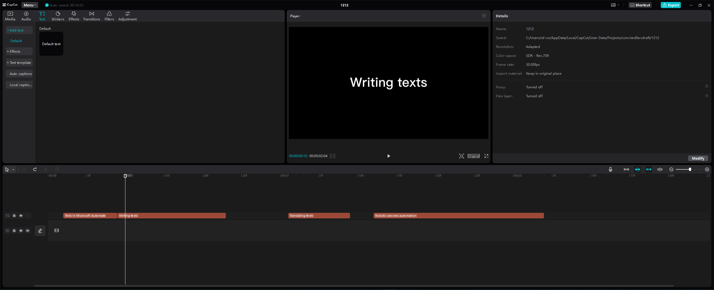

# RPA (Robotic Process Automation) Project

RPA is an application of technology, governed by business logic and structured inputs, aimed at automating specially repetitive processes.  
For this project, a RPA was developed in Microsoft Power Automate to automate a repetitive task in the video editing software called CapCut. The RPA goes through all the texts placed in a track as part of a video editing, translates them in Google Translate and paste again in the software, saving a lot of time in video editing process.

  

